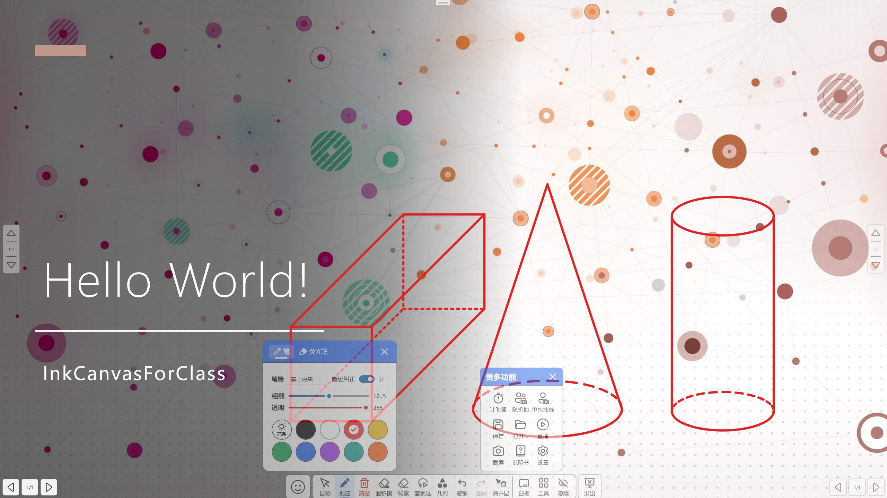

# InkCanvasForClass

Elegant by Default. Based on `ChangSakura/InkCanvas` .

**這將會是最後一次基於InkCanvas控件的倔強**

## 贊助支持

我已註冊愛發電，感謝各位對icc的支持！[https://afdian.net/a/dubi906w](https://afdian.net/a/dubi906w)

## 新網站即將上線！
新網站即將上線，快來一起和InkCanvasForClass見證美好時刻吧！[點我訪問](https://icc.bliemhax.com/)

## 嚴正聲明
本產品與peppy的osu!以及其周邊項目和產品無任何關聯，該Logo僅供娛樂用，若有侵權，請聯繫Dev協商解決。

## 公告
该项目旨在为ICA提供更加舒适和易于使用的UI和用户体验，对于任何墨迹书写方面的Bug如果本人无法修复将不会被修复。

## 前言
使用和分發本軟體前，請您應當且務必知曉相關開源協議，本軟體基於 https://github.com/ChangSakura/Ink-Canvas 修改而成，而ICA又基於 https://github.com/WXRIW/Ink-Canvas 修改而成，增添了包括但不限於隱藏到側邊欄等功能，更改了相關UI和軟體操作邏輯。對於墨跡書寫功能以及ICA獨有功能的相關 issue 提出，應優先查閱 https://github.com/WXRIW/Ink-Canvas/issues 。

[直接下載](https://gitea.bliemhax.com/kriastans/InkCanvasForClass/releases "Latest Releases")
——以壓縮檔案形式存儲，便攜版可直接啟動，默認配置適配絕大多數紅外觸摸框的設置。

> ⚠️注意：此項目仍在開發中，只會在發佈正式發行版時提供Release。您可以自行使用VS2022編譯打包後自行使用

## 特性
1. Support Active Pen (支持壓感)
2. 工具欄顯示了每個功能的文字描述
3. 添加了調色盤的顏色
4. 添加了熒光筆支持

## 提示
- 對新功能的有效意見和合理建議，開發者會適時回復並進行開發。本軟體並非商業性質軟體，請勿催促開發者，耐心才能讓功能更少 BUG、更加穩定。
- 此軟體僅用於私人使用，請勿商用。更新也不會很快，如果有能力請PR貢獻程式碼而不是在Issue裡面提問題。
- 歡迎您使用InkCanvas家族的其他成員，包括ICC和ICA的創始者IC以及和ICC差不多的ICA。您的大力宣傳能夠幫助我們的軟件被更多的用戶發現。

## FAQ

### 點擊放映後一翻頁就閃退？
考慮是由於`Microsoft Office`未啟用導致的，請自行啟用

### 放映後畫板程序不會切換到PPT模式？
如果你曾經安裝過`WPS`且在卸載後發現此問題則是由於暫時未確定的問題所導致，可以嘗試重新安裝WPS
> “您好，關於您回饋的情況我們已經回饋技術同學進一步分析哈，辛苦您可以留意後續WPS版本更新哈~” --回復自WPS客服

另外，處在保護（只讀）模式的PPT不會被識別

若因安裝了最新版本的 WPS 而導致無法在 WPS 軟體內進入 PPT 模式，可以嘗試卸載 WPS 後，並清除電腦垃圾、註冊表垃圾、刪除電腦上所有帶 "kingsoft" 名稱的文件夾，重新安裝 WPS 後，（以上步驟可能有多餘步驟），經測試在 WPS 內可以正常進入 PPT 模式。

ICC 可以支持 WPS，但目前無法同時支持 MSOffice 和 WPS。若要啟用 WPS 支持，請確保 WPS 是否在 “配置工具” 中開啟了 “WPS Office 相容第三方系統和軟體” 選項，該項目勾選並應用後，將無法檢測到 MS Office 的COM接口。

如果您安裝了“贛教通”、“暢言智慧課堂”等應用程式，可能會安裝“暢言備課精靈”，可能會導致遺失64為Office COM組建的註冊且目前似乎無法修復（可以切換到新用戶正常使用）。但 WPS Office 可以正常使用。

若要將 ICC 配合 WPS 使用，可打開“WPS 示範”後，前往“文件” - “選項” ，取消勾選“單螢幕幻燈片放映時，顯示放映工具欄”該項，獲得更好的體驗。若要將 ICC 配合 MS Office 使用，可以打開 Powerpoint，前往“選項” ，“高級”，取消勾選“顯示快捷工具欄”，獲得更好的體驗。

### **安裝後**程序無法正常啟動？
請檢查你的電腦上是否安裝了 `.Net Framework 4.7.2` 或更高版本。若沒有，請前往官網下載  

> 遇到各種奇葩逗比問題請重啟應用程式，如果不行請反饋給Dev解決！

## 如何聯繫我
1. QQ群聊：825759306
2. Telegram頻道：@InkCanvasForClass

## 特別鳴謝

<table>
    <tbody>
        <tr>
            <td align="center" valign="top" width="14.28%"><a href="https://github.com/ChangSakura"> <b>ChangSakura</b></a></td>
            <td align="center" valign="top" width="14.28%"><a href="https://github.com/WXRIW"> <b>WXRIW</b></a></td>
            <td align="center" valign="top" width="14.28%"><a href="https://github.com/Alan-CRL"> <b>Alan-CRL</b></a></td>
        </tr>
    </tbody>
</table>