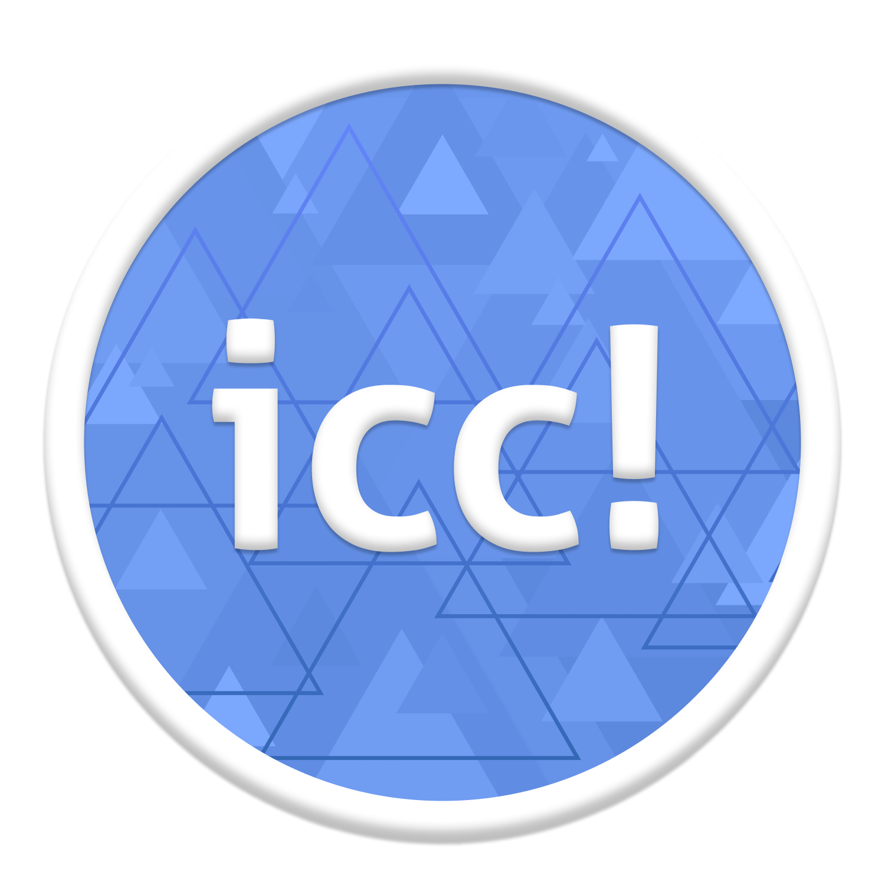

# InkCanvasForClass

<table>
    <tbody>
        <tr>
            <td><a href="InkCanvasForClass/">/InkCanvasForClass</a></td>
            <td>InkCanvasForClass v5 舊版項目</td>
        </tr>
        <tr>
            <td><a href="InkCanvasForClassX/">/InkCanvasForClassX</a></td>
            <td>InkCanvasForClass v6 新版項目（開發中）</td>
        </tr>
        <tr>
            <td><a href="CvtePaintDemo/">/CvtePaintDemo</a></td>
            <td>基於 <code>Cvte.Paint</code> 實現的高性能白板模式 Demo</td>
        </tr>
        <tr>
            <td><a href="Demos/">/Demos</a></td>
            <td>其他測試的Demo文件夾</td>
        </tr>
        <tr>
            <td><a href="Assets/">/Assets</a></td>
            <td>存放InkCanvasForClass開發過程中使用到的資源</td>
        </tr>
    </tbody>
</table>

## 贊助支持
我已註冊愛發電，感謝各位對icc的支持！[https://afdian.net/a/dubi906w](https://afdian.net/a/dubi906w)

## 新網站即將上線！
新網站即將上線，快來一起和InkCanvasForClass見證美好時刻吧！[點我訪問](https://icc.bliemhax.com/)

## 嚴正聲明
本產品與peppy的osu!以及其周邊項目和產品無任何關聯，該Logo僅供娛樂用，若有侵權，請聯繫Dev協商解決。

## 公告
舊項目（InkCanvasForClass，基於ICA分支的版本）將不再積極開發，依舊會修復Bug和功能優化，但開發週期將會變長。新項目InkCanvasForClassX不基於任何現有的IC家族的項目，完全重寫，只參考了IC、ICA、ICC舊版的設計理念和部分代碼，性能更好，更穩定。新項目正在開發中，已經新建文件夾了（XD），所以把這個repo變成MonoRepo。

## 提示
- 對新功能的有效意見和合理建議，開發者會適時回復並進行開發。本軟體並非商業性質軟體，請勿催促開發者，耐心才能讓功能更少 BUG、更加穩定。
- 此軟體僅用於私人使用，請勿商用。更新也不會很快，如果有能力請PR貢獻程式碼而不是在Issue裡面提問題。
- 歡迎您使用InkCanvas家族的其他成員，包括ICC和ICA的創始者IC以及和ICC差不多的ICA。您的大力宣傳能夠幫助我們的軟件被更多的用戶發現。
- 基於 `Cvte.Paint` 實現的高性能白板模式 Demo，可以實現希沃一體機的RawInput觸摸輸入和如希沃白板一樣的流暢體驗（因為就是“希沃白板”產品中提取出來的DLL）。該Demo力求將 `Cvte.Paint` 和 InkCanvasForClass的功能融合到一起，使其既擁有InkCanvasForClass一樣的操作邏輯和設計，又能提供來自希沃設備生態的便捷性。
- 基於 `Cvte.Paint` 實現的高性能白板模式 Demo，包含了由廣州視睿科技開發的程序，該Demo中使用了從“希沃白板”產品中提取出來的DLL。若有侵權問題，請聯繫開發者下架該Demo。

## 如何聯繫我
1. QQ群聊：825759306
2. Telegram頻道：@InkCanvasForClass

## 特別鳴謝

<table>
    <tbody>
        <tr>
            <td align="center" valign="top" width="14.28%"><a href="https://github.com/ChangSakura"> <b>ChangSakura</b></a></td>
            <td align="center" valign="top" width="14.28%"><a href="https://github.com/WXRIW"> <b>WXRIW</b></a></td>
            <td align="center" valign="top" width="14.28%"><a href="https://github.com/Alan-CRL"> <b>Alan-CRL</b></a></td>
        </tr>
    </tbody>
</table>