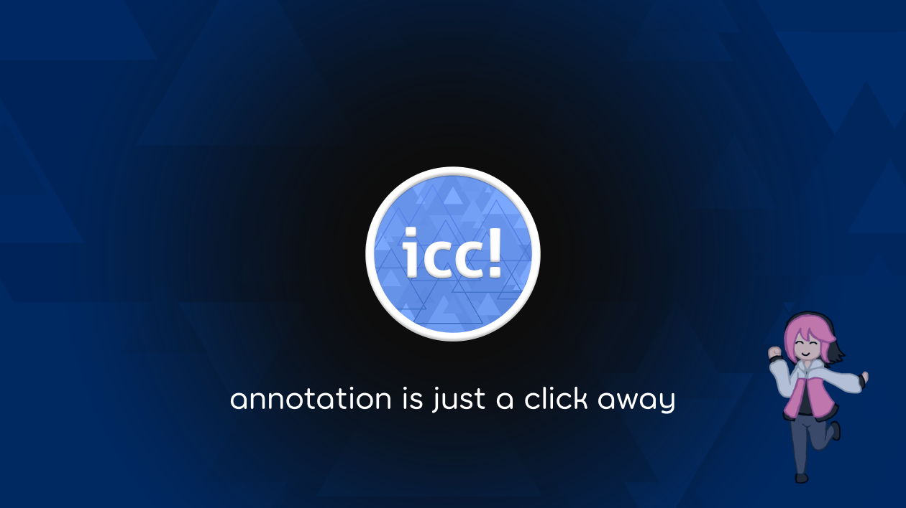
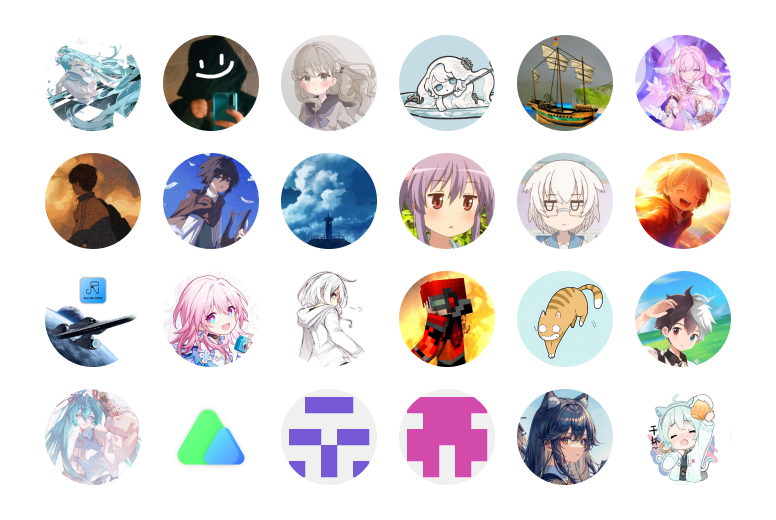

# InkCanvasForClass

Elegant by Default. Based on `ChangSakura/InkCanvas` .

一款开源易用的电子教鞭软件，专为课堂教学场景优化设计

**这将会是最后一次基于 `InkCanvas` 控件的倔强**

 

## 链接们
- 爱发电：[https://afdian.com/a/dubi906w/](https://afdian.com/a/dubi906w/) 
- 新网站：[https://icc.bliemhax.com/](https://icc.bliemhax.com/)
- QQ群聊：[https://qm.qq.com/q/ptrGkAcqMo/](https://qm.qq.com/q/ptrGkAcqMo/)
- Telegram频道：[https://t.me/InkCanvasForClass/](https://t.me/InkCanvasForClass/)

> [!important]
> 本产品与peppy的osu!以及其周边项目和产品无任何关联，若有侵权，请联系Dev协商解决。

---

- 佛系更新，仅供个人使用，禁止用于商业用途 
- 开学后更新比较缓慢，请不要催更！ 
- 如有需求请自行修改项目，同时也欢迎您的 Pull Request 和 Issue 提出  
- **基于 [https://github.com/InkCanvas/Ink-Canvas-Artistry](https://github.com/InkCanvas/Ink-Canvas-Artistry) 开发**

> [!important]
> **此项目仍在开发中，只会在发布正式发行版时提供Release** 
> QQ 群内有 ICC 比较稳定的版本，可以加 QQ 群获取

## 介绍

<strong>InkCanvasForClass 是基于 <a href="https://github.com/ChangSakura/">ChangSakura</a> 的 <a href="https://github.com/InkCanvas/Ink-Canvas-Artistry">Ink-Canvas-Artistry</a> 项目二次开发而来。该项目着重于优化原项目的 UI 设计使其变得更加便于在课堂上使用，同时也在积极开发新功能，修复原项目的不合理之处。</strong>

 

InkCanvasForClass 通过为教学环境下班班通设备的使用做出优化，让教学效率大幅度提升：

1. 使用 **`屏幕批注`** 功能快速在任何地方书写标记
2. 使用 **`快捷白板`** 迅速开始上课，提升课堂效率
3. 使用 **`形状识别`** 自动纠正手绘形状，提升各教学场景下的作图效率
4. 使用 **`形状绘制`** 进行精确绘图，方便易上手的操作提升了教学作图效率
5. 使用 **`随机点名`** 功能可以活跃课堂气氛，提升学生主动性......

## 功能

### 基础功能
- [X] 基本的屏幕批注
- [X] 白板模式（白板模式相关功能正在大改）
- [X] PPT 模式下的每页批注

### ICC 的优化和改进
- 浮动工具栏 UI 改进（正在填屎坑）
- 白板模式 UI 改进（还有背景色和稿纸模式）
- **鼠标手势**，可以让画布移动缩放，甚至是旋转，都变得更加轻松（正在开发）
- **全新的设置 UI**，正在逐步清理原项目的屎山
- **强制置顶**，基于 UIAccess + 输入线程抢夺的方法，保证 ICC 永远显示在所有软件的最顶层
- **分辨率和DPI变化监听**，保证 ICC 界面正常显示
- **高性能透明**，绘制使用多线程 UI + WindowChrome，摆脱低性能体验
- **画面冻结**，使当前画面定格
- **重写形状绘制**，让绘图体验更舒适方便，还会支持函数绘制和物理图绘制
- **PPT COM+VSTO双接口融合**，缓解 Office 和 WPS 共存导致的 COM 接口被占用的问题
- **PPT 系统优化**，高效 PPT 放映状态检测，不丢页不跳页
- **禁用边缘手势**，禁用烦人的 Windows10/11 的边缘触摸手势
- **点名器优化**，将会支持历史记录和多名单抽选，同时支持特殊配置
- **内置小工具**，内置计算器，英汉词典，倒计时，秒表，放大镜，截图等实用小工具
- **QuickPanel**，方便快捷的从 ICC 打开所有应用和调整系统设置
- **情境化配置**，每位老师都有专属的配置文件
- **插件和脚本系统**，支持使用 dotNet Framework 开发原生扩展或使用 Javascript 开发脚本来实现自动化操作或其他扩充功能
- **形状识别**，基于微软清朝老库的手绘形状自动识别，并提供形状绘制纠正功能
- **板书库**，高效管理所有板书，课程自动分类，提供云端同步
- **自动收纳**，检测到教学软件自动开启时会自动隐藏 ICC 界面到屏幕侧边
- **自动查杀**，检测到指定软件可以让 ICC 大打出手直接查杀并自动使用 ICC 进行替代
- **桌面悬浮窗屏蔽**，隐藏画板悬浮窗，还您一个干净的电脑桌面

还有其他没有列出...

_注：以上功能不能保证全部都出现在正式版中..._

## FAQ

### 壹 - ICC对PPT的相容性如何呢？

ICC 可以支持 WPS，但目前无法同时支持 MSOffice 和 WPS。若要启用 WPS 支持，请确保 WPS 是否在 “配置工具” 中开启了 “WPS Office 相容第三方系统和软件” 选项，该项目勾选并应用后，将无法检测到 MS Office 的COM接口。

如果您安装了“赣教通”、“畅言智慧课堂”等应用，可能会安装“畅言备课精灵”，因此会导致遗失64位的 Office COM 组件的注册且目前似乎无法修复（可以切换到新用户正常使用）。但 WPS Office 可以正常使用。

若要将 ICC 配合 WPS 使用，可打开“WPS 演示”后，前往“文件” - “选项” ，取消勾选“单萤幕幻灯片放映时，显示放映工具栏”该项，获得更好的体验。若要将 ICC 配合 MS Office 使用，可以打开 Powerpoint，前往“选项” ，“高级”，取消勾选“显示快捷工具栏”，获得更好的体验。

### 贰 - **安装后**程序无法正常启动？

请检查你的电脑上是否安装了 `.Net Framework 4.7.2` 或更高版本。若没有，请前往官网下载。

如果程序在启动后黑屏闪退，请打开 “事件查看器” 搜索有关 InkCanvasForClass 的错误信息并上报给开发者（可以在 GitHub 上提交 Issue，或者和开发者单独沟通）

> 遇到各种奇葩逗比问题请重启应用程式，如果不行请反馈给Dev解决！

## 特别鸣谢

🍰 **感谢下列同学对本项目的支持，因为有了你们，ICC 才能继续发展下去：**

🍰 **ICC 使用了下面的开源代码库：**

1. [**`Hardcodet.NotifyIcon.Wpf`**](https://github.com/hardcodet/wpf-notifyicon)   _An implementation of a NotifyIcon (aka system tray icon or taskbar icon) for the WPF platform._
2. [**`JetBrains.Annotations`**](https://github.com/JetBrains/JetBrains.Annotations)   _JetBrains.Annotations help reduce false positive warnings, explicitly declare purity and nullability in your code, deal with implicit usages of members, support special semantics of APIs in ASP.NET and XAML frameworks and otherwise increase accuracy of JetBrains Rider and ReSharper code inspections._
3. [**`Newtonsoft.Json`**](https://github.com/JamesNK/Newtonsoft.Json)   _Popular high-performance JSON framework for .NET_
4. [**`NHotkey`**](https://github.com/thomaslevesque/NHotkey)   _Easily handle shortcut keys even when your WPF or WinForms app doesn't have focus. Declare hotkeys in XAML with the familiar `KeyBinding` syntax._
5. [**`Ookii.Dialogs.Wpf`**](https://github.com/ookii-dialogs/ookii-dialogs-wpf)   _A class library for WPF applications providing several common dialogs. Included are classes for task dialogs, credential dialog, progress dialog, and common file dialogs._
6. [**`OSVersionExt`**](https://github.com/pruggitorg/detect-windows-version)   _Allows you to determine the correct Windows version, since System.Environment.OSVersion.Version in .NET Framework and .NET Core until version 4.8 respectively 3.1 returns wrong results on Windows 10. It works starting with Windows 2000 and also on Windows 11/Windows 10/Server 2022/Server 2019/Server 2016 right away._
7. [**`PixiEditor.ColorPicker`**](https://github.com/PixiEditor/ColorPicker)   _A collection of various WPF controls used to select colors. Supports .NET Framework 4.5.1+, .NET Core 3.1+, .NET 5 - 7._
8. [**`Vanara.PInvoke`**](https://github.com/dahall/Vanara)   _This project contains various .NET assemblies that contain P/Invoke functions, interfaces, enums and structures from Windows libraries._

🍰 **ICC 被下列开源项目推荐：**

1. [kriastans/Awesome-Iwb](https://github.com/kriastans/Awesome-Iwb)
2. [Jursin/Awesome-Class-Softwares](https://github.com/Jursin/Awesome-Class-Softwares)

🍰 **ICC 小量的使用了由 iNKORE Studios 开发的控件库：[`iNKORE.UI.WPF.Modern`](https://github.com/iNKORE-NET/UI.WPF.Modern/)**
 _Modern (Fluent 2) styles and controls for your WPF applications._

  
  
  
  
  

## 开发

本项目目前开发状态：

- 正在 [`master`](https://github.com/InkCanvasForClass/InkCanvasForClass/tree/master) 分支上开发第一个正式版本 **v6.0.0**。

要在本地编译应用，您需要安装以下负载和工具：
1. **[.NET Framework 4.7.2](https://dotnet.microsoft.com/en-us/download/dotnet-framework/net472)**
2. [Visual Studio](https://visualstudio.microsoft.com/)

对于 Visual Studio，您需要在安装时勾选以下工作负载：
- .NET 桌面开发

## 子项目

**`InkCanvasForClass.IACoreHelper`**  
该项目实现了基于 .NET Framework 4.7.2 和 x86 运行环境的墨迹识别库 IACore 的封装。

**`InkCanvasForClass.PowerPoint.InteropHelper`**  
该项目将 ICC 的 PPT 适配功能给单独提取了出来，并下放 ZPH 的部分功能到本项目上面。

**`InkCanvasForClass.PowerPoint.Vsto`**  
该项目实现了 ICC 对 PPT 的 VSTO 插件支持，可以缓解 Office 和 WPS 共存导致的 COM 接口被占用的问题（或者其他任何有关 COM 接口的疑难杂症，只要软件正常，文档不是被保护文档或兼容模式或只读文档，VSTO都能行）。

**`InkCanvasForClassX`**  
该项目已废弃，皆在重写 ICC（💀bro以为自己能够摆脱 IC 的💩山）。

**`InkCanvasForClass.IccInkCanvas`**  
该项目将 ICC 魔改的 InkCanvas 控件给提取了出来，方便控件重用，减少 ICC 主程序代码量。封装选择V2、橡皮V2、实时笔锋、白板多页面管理、漫游管理、快捷键重写以及其他魔改。

**`InkCanvasForClass.IccInkCanvas.Demo`**  
IccInkCanvas 的 Demo 测试。

## 开源许可

**本项目基于 GNU General Public License Version 3 进行开源**

1. 你可以免费使用、复制、修改、分发受保护程序，但分发时一定要提供源码。
2. 你可以收费。比如可以针对目标码、源码的分发收费，可以针对软件的维修保养（主要是提供技术支持）收费；但不能收许可费、版税、专利许可费、授权费这类费用。
3. GPL程序的所有贡献者，自动免费提供了专利许可，承诺不会告人侵犯专利权（前提是你遵守了GPL）。
4. GPL程序允许别人破解。如果是用在消费类硬件上，要允许人修改并安装程序。

## 开发者

Doubx690i(Dubi906w/kriastans) `逗比的九百有六大不留`

## 耻辱柱

牢记 **`幻想熵K2ro`** 对本项目带来的影响。